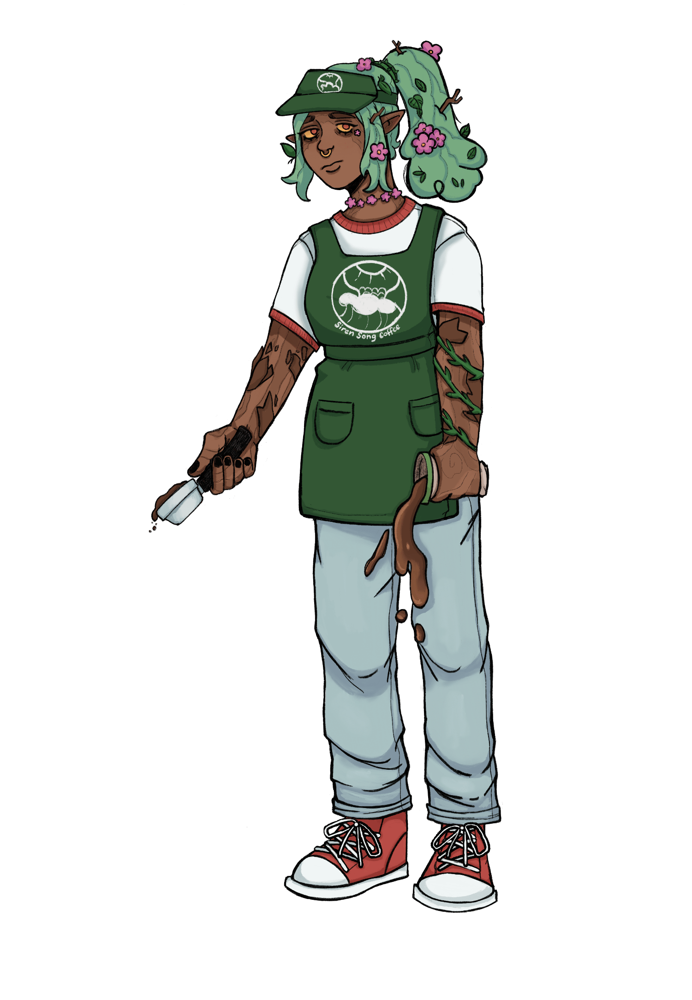

# October 9th, 2021 (Challenge 8)

Prompt: **Pumpkin Spice**

### Barista Dryad

#### Description

Most dryads act as sworn protectors of the forests they inhabit, preventing incursion by the men of the world who would exploit the land for personal gain. Their lives are intrinsically tied to their trees, and as long as the forest thrives, so too do the dryads. The death of the forest will mark the end of a dryad's otherwise unending lifespan.

On very rare occasion, a dryad can endure the encroachment of man and persist through the gentrification of its forest. Her tree might be spared from destruction and used as urban decoration, or structures might be built around it and incorporate the trunk into their designs. In these cases, the dryad's forest pledge will shift to instead support the city's economy.

If the dryad is extremely unlucky, she might be conscripted in this manner to work at a café, becoming a barista dryad. The dryad will do her best to ensure the success of the business in order to keep her tree alive, but this forced servitude tends to create spite and anger, leading to a mischievousness in how she carries out her duties to the shop.

Barista protest comes most often by "accidentally" messing up drink orders, but a dryad takes it to another level by infusing the sugary flavor additions with magical poison to corrupt the beverage. Beings that survive might have their faculties compromised, allowing the dryad a limited form of control over their actions. Strangely, this does little to prevent people from buying terrible overpriced coffee drinks.

Particularly mischievous dryads might use their fey ability to take the names of others during the drink order. A creature who willingly gives their name for the order and drinks the dryad's flavored beverage will find itself with a corrupted misspelling of its own name, and be cursed to keep that name until it can make a deal with the dryad to be restored. A dryad might use this influence over her customers to build a group of loyal subjects with which she can overthrow the coffee shop and reclaim control of her tree and domain.

<figure>
  
  <figcaption>Barista Dryad by <a href="https://ko-fi.com/globaldad">GlobalDad</a></figcaption>
</figure>

#### Attributes

_Medium Fey, Lawful Neutral_

**AC** 16 **Initiative** +4 (14)

**HP** 130 (20d8 + 40)

**Speed** 30 ft.

|       |   | MOD | SAVE |       |   | MOD | SAVE |
|:-----:|:-:|:---:|:----:|:-----:|:-:|:---:|:----:|
|**STR**|12 | +1  |  +1  |**INT**|13 | +1  |  +4  |
|**DEX**|18 | +4  |  +4  |**WIS**|18 | +4  |  +7  |
|**CON**|15 | +2  |  +2  |**CHA**|22 | +6  |  +9  |

**Skills** Nature +4, Sleight of Hand +7

**Senses** Passive Perception 13

**Languages** Common, Elvish, Sylvan

**CR** 8 (XP 3,900; PB +3)

### Traits

- _**Innate Spellcasting.**_ The dryad’s innate spellcasting ability is Charisma (spell save DC 17). The dryad can innately cast the following spells, requiring no material components:

 At will: _druidcraft_, _poison spray_

 3/day each: _chaos bolt_, _entangle_, _ray of sickness_

 1/day each: _circle of death_, _counterspell_, _dominate beast_, _enervation_
- _**Magic Resistance.**_ The dryad has advantage on saving throws against spells and other magical effects.
- _**Magic Weapons.**_ The dryad’s weapon attacks are magical.
- _**Tree Stride.**_ Once on her turn, the dryad can use 10 feet of her movement to step magically into one living tree within her reach and emerge from a second living tree within 120 feet of the first tree, appearing in an unoccupied space within 5 feet of the second tree. Both trees must be Large or bigger.

### Actions

_**Spellcasting.**_ The dryad casts one of the following spells, requiring no Material components and using Charisma as the spellcasting ability (spell save DC 17):

**At Will:** _Druidcraft_, _Poison Spray_

 3/day each: _Chaos Bolt_, _Entangle_, _Ray of Sickness_

 1/day each: _Circle of Death_, _Counterspell_, _Dominate Beast_, _Enervation_

_**Quarterstaff.**_ _Melee Attack Roll:_ +9 to hit, reach 5 ft. _Hit:_ 10 (1d8 + 6) Bludgeoning damage.

_**Cinnamon Challenge (Recharge 5-6).**_ The dryad blows a handful of cinnamon in a 30-foot cone. Each creature in that area must make a DC 16 Constitution saving throw.

On a failed save, a creature takes 13 (3d8) Fire damage and erupts into a coughing fit. While coughing, the creature is incapacitated. At the end of the creature's turn, it can end the coughing fit by succeeding on a DC 13 Constitution saving throw. Creatures that don't have to breathe air are unaffected by the cinnamon.

_**Flair (3/Day).**_ The dryad magically charms all creatures within 30 feet who gave her their true names or are currently poisoned by her drink. While charmed in this manner, a creature regards the dryad as a trusted friend to be heeded and protected. Although the target isn't under the dryad's control, it takes the dryad's requests or actions in the most favorable way it can.

Each time the dryad or her allies do anything harmful to the target, it can end the charm effect on itself by succeeding on a DC 16 Wisdom saving throw. Otherwise, the effect lasts 24 hours or until the dryad dies, is on a different plane of existence from the target, or ends the effect as a bonus action. After the effect ends, the target is immune to the dryad's Flair for the next 24 hours, unless it gave the dryad its true name.

_**Flavor Pump.**_ The dryad poisons one drink within 5 feet. A drink poisoned in this manner takes on a random sweet flavor which magically obscures the poison from detection. A creature that ingests the drink must succeed on a DC 14 Constitution saving throw or become Poisoned for 1 hour. Roll on the **Flavor Pump** table to determine the poisoned drink's additional effect. Ingesting multiple drinks will potentially stack multiple effects but does not change the duration of the Poisoned condition.

##### Flavor Pump (d10 table)

- 1: **Almond.** The Poisoned creature is disoriented for 1 minute or until it takes damage. At the start of each of its turns, the disoriented creature spends all its movement to move in a random direction until it reaches a barrier. If the movement would put it in dangerous terrain (such as a precipice or caltrops), it can stop its movement before entering that space by succeeding on a DC 10 Dexterity saving throw.
- 2: **Caramel.** The Poisoned creature has the Stunned condition for 1 minute. At the end of each of its turns, it can repeat the saving throw to end the Poisoned and Stunned conditions.
- 3: **Cinnamon Dolce.** The Poisoned creature takes 22 (5d8) Fire damage and has the Prone condition.
- 4: **Coconut.** The Poisoned creature has the Deafened condition for 10 minutes or until it takes damage. Until the Deafened condition ends, the creature is unable to use Verbal components for casting spells.
- 5: **Gingerbread.** The Poisoned creature has the Blinded condition for 10 minutes or until it takes damage.
- 6: **Hazelnut.** The Poisoned creature falls into a magical slumber for 1 minute, until it takes damage, or until another creature uses an action to wake it up.
- 7: **Mocha.** The Poisoned creature is hyper for 1 minute. While hyper in this manner, it is under the effects of the _Haste_ spell (no concentration required). When the creature is no longer hyper, it suffers one level of Exhaustion.
- 8: **Peppermint.** The Poisoned creature takes 14 (4d6) Cold damage, and its Speed is halved for 1 minute.
- 9: **Pumpkin Spice.** The Poisoned creature has an intense craving for the dryad's drinks for 1 minute or until it consumes another dryad drink. While in this state, it must spend its entire turn seeking out and consuming these drinks. At the end of each of its turns, it can end the craving by succeeding on a DC 13 Wisdom saving throw.
- 10: **Vanilla.** The Poisoned creature rolls on a **Wild Magic Surge** table.

---

| ⬅️ [October 8th: Psychopomp](2021-10-08-psychopomp.md) | [October 10th: Supernatural](2021-10-10-supernatural.md) ➡️ |
|:-|-:|
